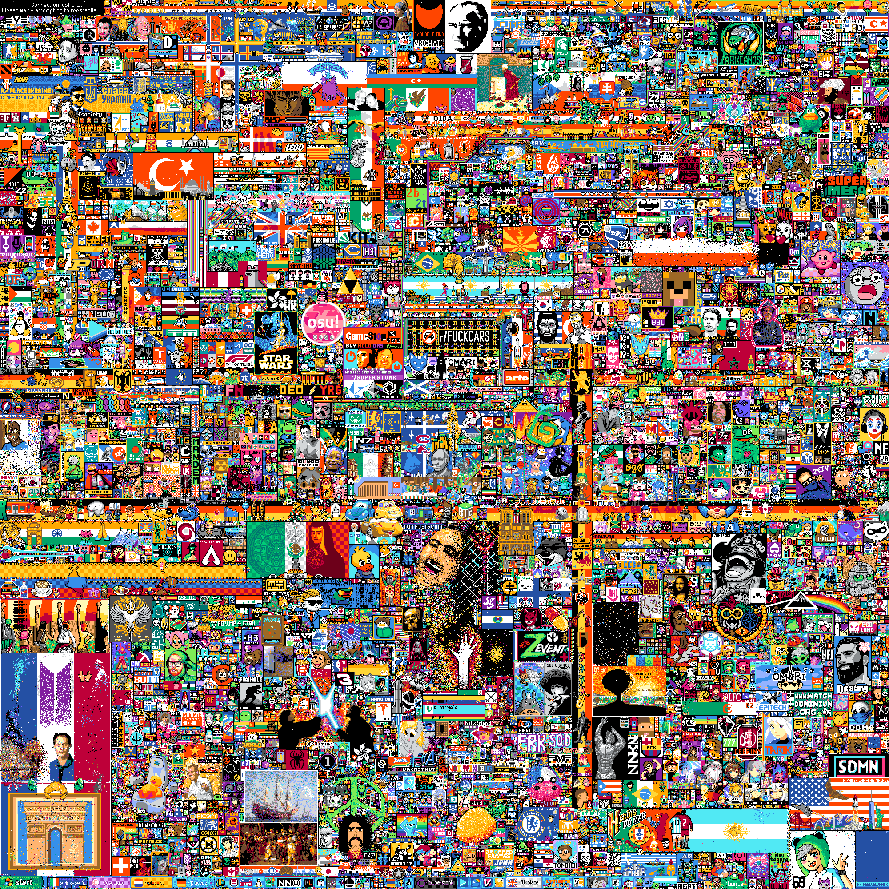
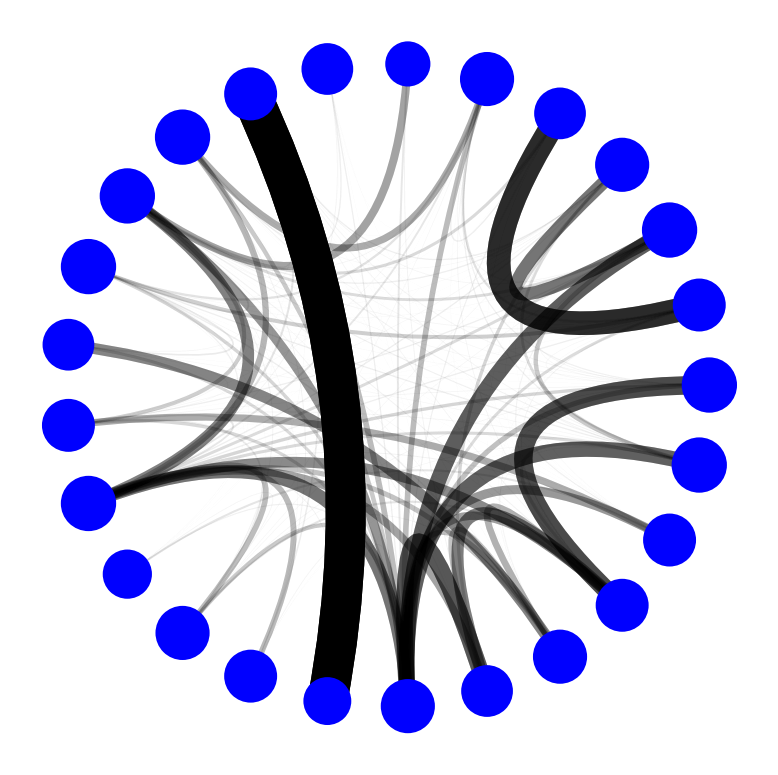
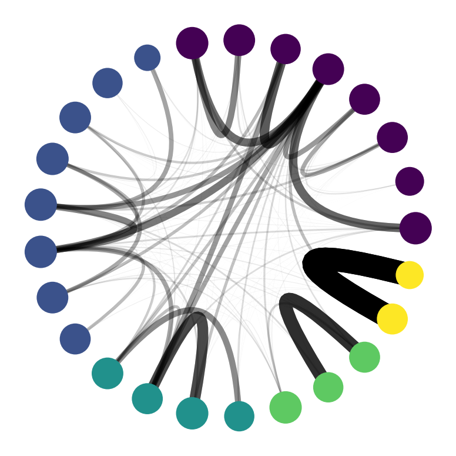
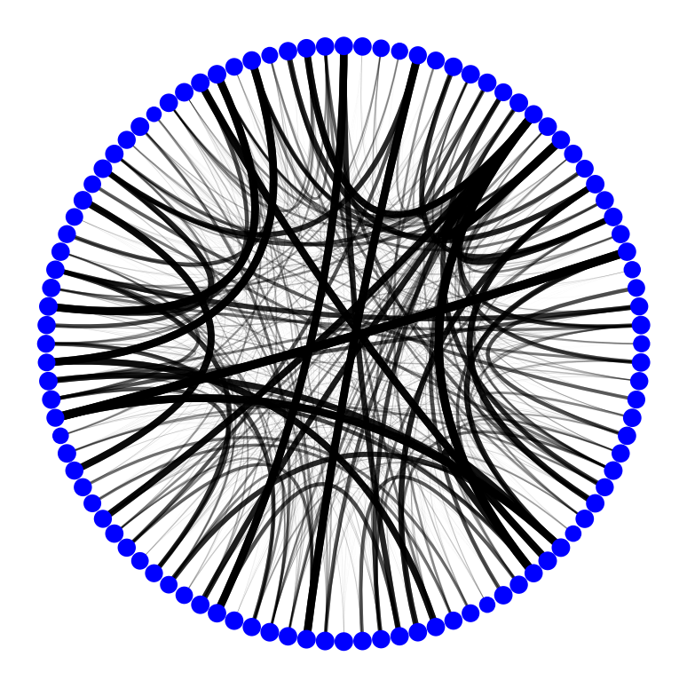
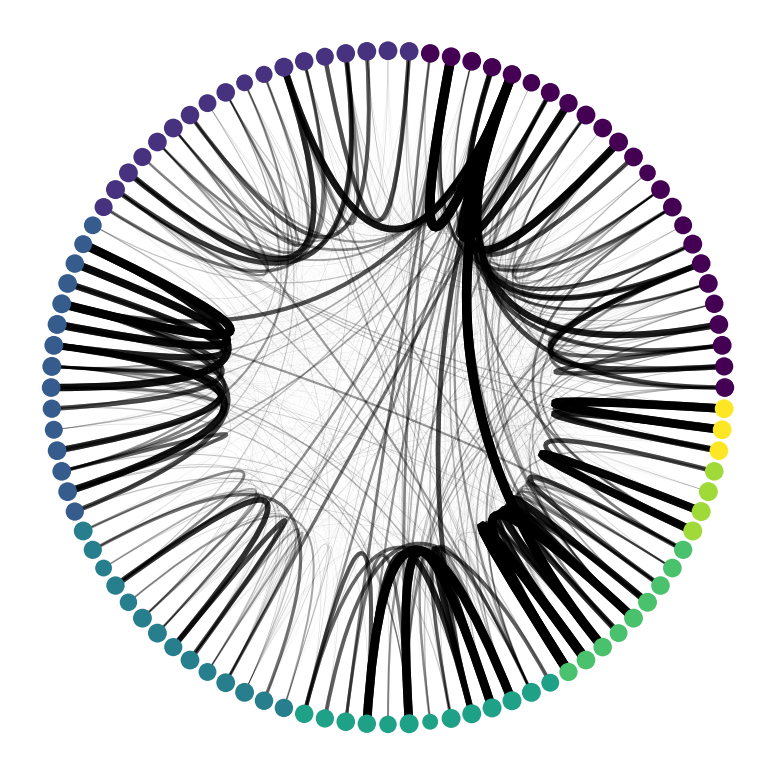

# Network of collaborations in r/Place 2022
I thought that it would have been really cool to study and try to visualize the interaction between contributors of Reddit Place 2022 event. If you don't know what it is: [r/place](https://www.reddit.com/r/place/) or watch the [timelapse](https://www.youtube.com/watch?v=K5O3UgLG2Jw).

I took a network science course titled **"Complexity in social systems"** and decided to bring this work as final project and it was really appreciated (or maybe I just have been lucky to have the professor nerdy enough to appreciate it).




## Description
The initial question of the project was if it's possible to group contributors in communities based on which artwork they have contributed to.
It turns out to be not an easy task due to the **huge** number of users and their activity. To give an idea:
- 160 million pixel modified
- 10 million unique users
- almost 10k different artworks

Then I had to make some simplifying assumptions. Unfortunately it would be difficult to explain here every steps, but [Here](https://github.com/pietro-sillano/r-place-Network-Analysis/blob/main/docs/Reddit_place_ENG.pdf) you can find the presentation slides with the main steps.

# Results
   

That's the **network representation** for 25 (and 100) artworks respectively. Each node is an artwork and nodes linked together share contributing users. The width of the link represent the number of shared users.

The figures with coloured nodes are the network representation after the community detection algorithm (Newman modularity algorithm). Communities are different artworks that shared same users. This could be a signal for **collaboration** and for **competition** too.

# Future developments
- Analyze the collaboration / competition relationships

- Consider the dynamics and evolution of the canvas over time

# In Details
```
├── notebooks
     |
     ├─ 00_statistics_figures.ipynb Some statistics and plots
     |
     ├─ 01_bipartite_network.ipynb create bipartite network edgelist
     |
     ├─ 02_A_Analysis.ipynb Analysis for the 25 artworks
     |
     ├─ 02_B_Analysis.ipynb Analysis for the 100 artworks

├── scripts
     │
     └────  trimming.py : reduce size of the reddit dataset, changes datatypes,
    simplify user_id, separate coordinates, converts timestamp to integers in ms. From 20 Gb to 4 Gb.
```


# Contributing
Any kind of suggestion or contribution is welcomed.
